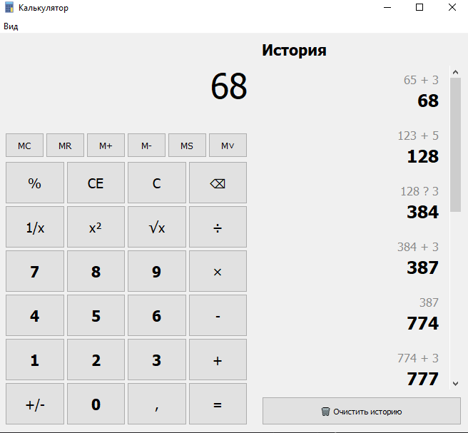

# Qt Calculator

Калькулятор на **Qt Widgets** и **C++11**. Поддерживает боковую панель истории, расширенную память, темную тему.

## ✨ Основные возможности

* ✅ **Базовые операции**: +, -, ×, ÷
* ✅ **Расширенные функции**: √x, x², 1/x, %, ±
* ✅ **Боковая панель истории** (Ctrl+H) 🆕
  - Открывается справа внутри окна
  - Двухстрочный формат записей (как в Windows)
  - Клик по записи копирует результат
  - Автообновление в реальном времени
  - Hover эффекты
* ✅ **Расширенная память** (MC, MR, M+, M-, MS, M˅) 🆕
  - 6 функций памяти
  - MS - сохранение в память
  - M˅ - список из 10 значений
  - Быстрое добавление (Ctrl+M)
* ✅ **Темная тема** (Ctrl+T)
  - Светлая и темная тема
  - Автосохранение предпочтений
  - Определение системной темы
* ✅ **Копирование результата** (Ctrl+C)

## Быстрый старт

```bash
# Сборка
cmake -S . -B build
cmake --build build

# Запуск (Linux/Mac)
./build/src/calc

# Запуск (Windows)
.\build\src\calc.exe
```

## Интерфейс


вставь суда 


## Структура проекта

```
calc/
├── src/                        # Исходники
│   ├── main.cpp
│   ├── mainwindow.cpp/h/ui
│   ├── calchandler.cpp/h
│   ├── calculationhistory.cpp/h
│   ├── historypanel.cpp/h
│   ├── historydialog.cpp/h
│   ├── memorymanager.cpp/h
│   ├── memorydropdowndialog.cpp/h
│   ├── thememanager.cpp/h
│   ├── uianimations.cpp/h
│   ├── displayformatter.cpp/h
│   ├── inputvalidator.cpp/h
│   └── calculatorconfig.h
├── tests/                      # Unit-тесты (78 тестов)
│   ├── test_calchandler.cpp
│   ├── test_calculationhistory.cpp
│   ├── test_displayformatter.cpp
│   ├── test_inputvalidator.cpp
│   ├── test_memorymanager.cpp
│   ├── test_thememanager.cpp
│   ├── test_uianimations.cpp
│   └── test_mainwindow.cpp
├── docs/
│   └── images/                 # Скриншоты
├── CMakeLists.txt
└── README.md
```

## Скриншот


## Использование

### Горячие клавиши

| Клавиша        | Действие                 |
| -------------- | ------------------------ |
| 0-9            | Ввод цифр                |
| `+ - * /`      | Операторы                |
| `. ,`          | Десятичная точка         |
| `Enter` / `=`  | Посчитать результат      |
| `Backspace`    | Удалить последний символ |
| `Delete` / `Esc` | Очистить всё           |
| `%`            | Проценты                 |
| **Ctrl+C**     | Копировать результат     |
| **Ctrl+H**     | Открыть/закрыть историю  |
| **Ctrl+M**     | M+ (добавить в память)   |
| **Ctrl+T**     | Переключить тему         |

### Функции памяти

| Кнопка | Описание |
| ------ | -------- |
| **MC** | Memory Clear - очистить память |
| **MR** | Memory Recall - вспомнить из памяти |
| **M+** | Memory Add - добавить к памяти |
| **M-** | Memory Subtract - вычесть из памяти |
| **MS** | Memory Store - сохранить в память |
| **M˅** | Memory Dropdown - список из 10 значений |


## Требования и зависимости

- **Qt 5 или Qt 6**
- **CMake** 3.5+
- **Компилятор** с поддержкой C++11
- **Qt Test**

## Сборка проекта

### Linux / macOS

```bash
cmake -S . -B build -DCMAKE_BUILD_TYPE=Release
cmake --build build
./build/calc
```

### Windows (Visual Studio)

```powershell
cmake -S . -B build -G "Visual Studio 17 2022" -A x64
cmake --build build --config Release
.\build\Release\calc.exe
```

## Проблемы сборки

**Qt не найден**: укажи путь к установленному Qt через `CMAKE_PREFIX_PATH` или `Qt5_DIR`/`Qt6_DIR`.
Пример:
```powershell
cmake -S . -B build -DCMAKE_PREFIX_PATH="C:\Qt\5.15.2\mingw81_64"
```

**Конфликт генератора (VS ↔ MinGW)**: используй новый каталог сборки или удали старый `build/`.
```powershell
Remove-Item -Recurse -Force build
```

**Несовместимость компилятора и Qt**: Qt для MinGW нужно собирать через `-G "MinGW Makefiles"`,
Qt для MSVC — через генератор Visual Studio. Наборы должны совпадать.

## Тестирование

```bash
cd build
ctest --verbose
```

